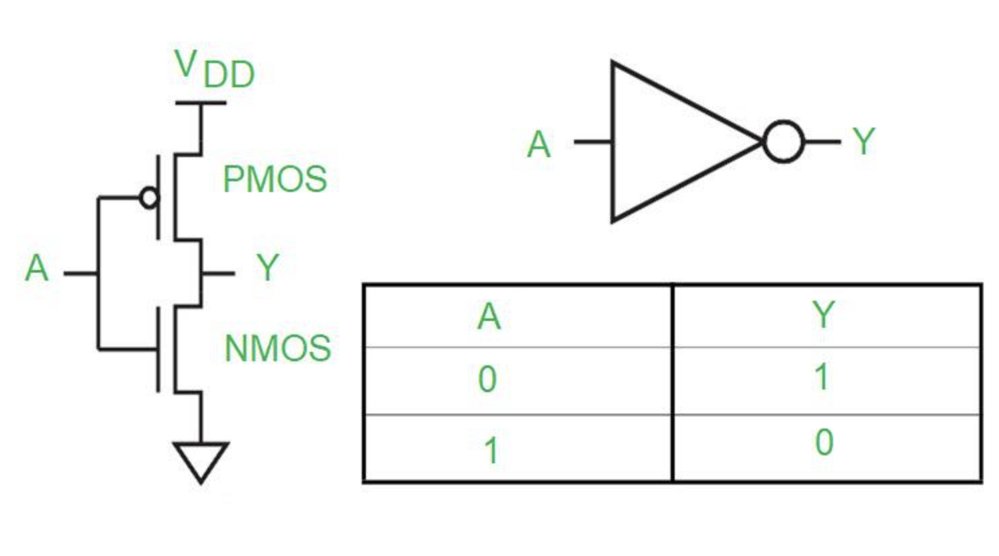

### CMOS Inverter

Project: Build a CMOS inverter and fully analyze its delay, capacitance, and power.

A CMOS inverter is a tiny circuit that flips a digital signal. It implements a logic function:

$$
Y = \bar{A}
$$

But physically, it is made from two transistors, not magic logic gates.

#### MOSFET

A MOSFET (Metal Oxide Semiconductor Field Effect Transistor) is a voltage controlled switch. You can apply voltage to the gate. That voltage controls whether current can flow. Almost no current flows into the gate itself.

Both NMOS and PMOS transistors are voltage controlled switches. They have gate (metal),
oxide (insulator), and source/drain (semiconductor) terminals.The only real difference is the type of doped silicon used.

Pure silicon coducts poorly. We improve it by doping: N-type has extra electrons and P-type has extra holes.

**NMOS transistors (N-channel MOSFET)**

NMOS body (substrate) is made of P-type silicon. Source and Drain are made of N+ region(electron rich). Here the electrons are the carriers of current.

The gate is made of metal. When the gate is at a high voltage, electric field pulls electrons to surface. An N-type channel forms, and electron flows from source to drain, i.e., the channel becomes conductive. When the gate is at a low voltage, the channel is insulating.

Electrons move fast so NMOS is stronger and faster.

There is a minimum voltage required:

$$
V_{GS} > V_{th}
$$

Where, $V_{GS}$ is the gate-to-source voltage and $V_{th}$ is the threshold voltage (~0.3-0.7 V).

**PMOS transistors (P-channel MOSFET)**

PMOS body (substrate) is made of N-type silicon. Source and Drain are made of P+ region(hole rich). Here the holes are the carriers of current.

The gate is made of metal. When the gate is at a low voltage (negative relative to source), electric field pulls holes to the surface. A P-type channel forms, and hole flows from source to drain, i.e., the channel becomes conductive. When the gate is at a high voltage, the channel is insulating.

Holes move slower than electrons so PMOS is weaker and slower.

There is a minimum voltage required:

$$
V_{GS} < V_{th}
$$

Where, $V_{GS}$ is the gate-to-source voltage and $V_{th}$ is the threshold voltage (~0.3-0.7 V).

#### CMOS Inverter

A CMOS inverter is the simplest digital logic gate. It does exactly one thing.

```PseudoAssembly
OUTPUT = NOT INPUT
```

Input = 0 → Output = 1  
Input = 1 → Output = 0

A CMOS inverter uses two transistors.

PMOS (top) pulls the output up to VDD when input is 0.
NMOS (bottom) pulls the output down to GND when input is 1.



CMOS consists of a series of connection of a PMOS and an NMOS. VDD represents the voltage of logic 1, while ground represents the logic 0.

Whenever the input is high or 1, the NMOS is switched on while the PMOS is turned off. Thus output Y is directly connected to the ground and thus comes to be logic 0.

When the input is logic 0, the reverse happens - NMOS goes off and PMOS goes on. This provides a direct path between VDD and output Y. Hence Y becomes high. This is the basic principle of operation of a CMOS inverter.

**Signal Delay Analysis**

NMOS is faster than PMOS. NMOS has a lower threshold voltage $V_{th,n}$ and PMOS has a higher threshold voltage $V_{th,p}$.

The CMOS inverter output is driven by the NMOS/PMOS transistors, which acts like capacitors.
