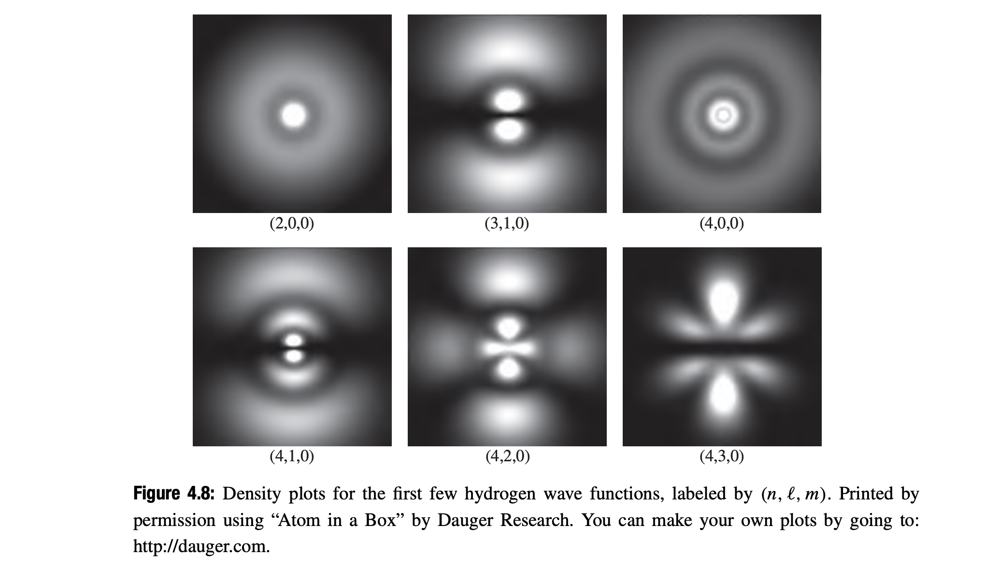

### The Hydrogen Atom

From Columb's law, the potential energy of an electron

$$
V(r) = - \frac{e^2}{4 \pi \epsilon_0} \frac{1}{r}
$$

The radial equation then becomes

$$
-\frac{\hbar^2}{2m_e} \frac{d^2 u}{dr^2} + [- \frac{e^2}{4 \pi \epsilon_0} \frac{1}{r} + \frac{\hbar^2}{2m_e} \frac{l(l+1)}{r^2}]u = Eu
$$

#### The Radial Wave Function

$$
\kappa = \frac{\sqrt{-2 m_e E}}{\hbar}
$$

For bound states, $E$ is negative, so $\kappa$ is real. Dividing the radial equation by $E$, we have

$$
\frac{1}{\kappa^2} \frac{d^2 u}{dr^2} = [1 - \frac{m_e e^2}{2 \pi \epsilon_0 \hbar^2 \kappa} \frac{1}{(\kappa r)} + \frac{l(l+1)}{(\kappa r)^2}]u
$$

We introduce,

$$
\rho \equiv \kappa r, \space \rho_0 \equiv \frac{m_e e^2}{2 \pi \epsilon_0 \hbar^2 \kappa}
$$

Thus,

$$
\frac{d^2 u}{d\rho^2} = [1 - \frac{\rho_0}{\rho} + \frac{l(l+1)}{\rho^2}] u
$$

Now we examine the asymptotic form of solution. As $\rho \to \infin$, the constant term dominates

$$
\frac{d^2 u}{d\rho^2} = u
$$

The general solution is 

$$
u(\rho) = Ae^{-\rho} + B e^{\rho} 
$$

The second term blows up as $\rho \to \infin$. So $B$ is zero.

$$
u(\rho) \sim A e^{-\rho}
$$

for large $\rho$. On other hand, as $\rho \to 0$, the centrifugal term dominates,

$$
\frac{d^2 u}{d\rho^2} = \frac{l(l+1)}{\rho^2} u
$$

The general solution is 

$$
u(\rho) = C \rho^{l+1} + D \rho^{-l}
$$

but $\rho^{-l}$ blows us as $\rho \to 0$, so $D$ is zero. Thus,

$$
u(\rho) \sim C \rho^{l+1}
$$

Now we peel off the asymptotic behavior, introducing the new function $v(x)$

$$
u(\rho) = e^{-\rho} \rho^{l+1} v(\rho)
$$

$$
\frac{du}{d\rho} = \rho^l e^{-\rho} ((l+1-\rho)v + \rho \frac{dv}{d\rho})
$$

$$
\frac{d^2u}{d\rho^2} = \rho^l e^{-\rho} \{ [-2l - 2 + \rho + \frac{l(l+1)}{\rho}]v + 2(l+1-\rho) \frac{dv}{d\rho} + \rho \frac{d^2 v}{d\rho^2} \}
$$

The radial equation in terms of $v$ becomes

$$
\rho \frac{d^2 v}{d\rho^2} + 2(l+1-\rho) \frac{dv}{d\rho} + [\rho_0 - 2(l+1)] v = 0
$$

We assume the solution as follows:

$$
v(\rho) = \sum_{j=0}^\infin c_j \rho^j
$$

$$
\frac{dv}{d\rho} = \sum_{j=0}^\infin (j+1) c_{j+1} \rho^j
$$

$$
\frac{d^2v}{d\rho^2} = \sum_{j=0}^\infin j(j+1) c_{j+1} \rho^{j-1}
$$

Therefore after inserting into radial eqation we get following relatinship of coefficient

$$
c_{j+1} = \frac{2(j+l+1)-\rho_0}{(j+1)(j+2l+2)} c_j
$$

For sufficiently large $j$, we get

$$
c_j \approx \frac{2^j}{j!} c_0
$$

If we consider this as an exact solution and solve for $u$, we find that $u$ blows up at large $\rho$. So the series must terminate.

$$
C_{N+1} \ne 0, \space c_N = 0
$$

which means from our previous coeficeint relation.

$$
2(N+l) - \rho_0 = 0
$$

Define:

$$
N+l \equiv n
$$

So,

$$
\rho_0 = 2n
$$

But $\rho_0$ determines the energy,

$$
E = - \frac{\hbar^2 \kappa^2}{2m} = - \frac{m_e e^4}{8 \pi^2 \epsilon_0^2 \hbar^2 \rho_0^2 }
$$

Therefore,

$$
E_n = - \frac{m_e e^4}{8 \pi^2 \epsilon_0^2 \hbar^2 4 n^2 }, \space n=1,2...
$$

This is Bohr's formula. 

$$
\kappa = (\frac{m_e e^2}{4 \pi \epsilon_0 \hbar^2}) \frac{1}{n} = \frac{1}{an}
$$

where, $a=0.529 \times 10^{-10} m$ is called Bohr's radius. It also follows that

$$
\rho = \frac{r}{an}
$$

The spatial wave function are labeled by three quantum numbers ($n$, $l$ and $m$).

$$
\psi_{nlm}(r, \theta, \phi) = R_{nl}(r) Y^m_l(\theta, \phi)
$$

where,

$$
R_{nl}(r) = \frac{1}{r} \rho^{l+1} e^{-\rho} v(\rho)
$$

where, $v(\rho)$ is a polynomial of degree $n-l-1$ in $\rho$ whose coefficient are determined by

$$
c_{j+1} = \frac{2(j+l+1)-\rho_0}{(j+1)(j+2l+2)} c_j
$$

The polynomial $v(\rho)$ is a function well known and can be written as 

$$
v(\rho) = L^{2l+1}_{n-l-1}(2\rho)
$$

where

$$
L^p_q(x) = (-1)^p (\frac{d}{dx})^q L_{p+q}(x)
$$

is an associated Laguerre polynomial.

where

$$
L_q(x) = \frac{e^x}{q!} (\frac{d}{dx})^q (e^{-x} x^q)
$$

